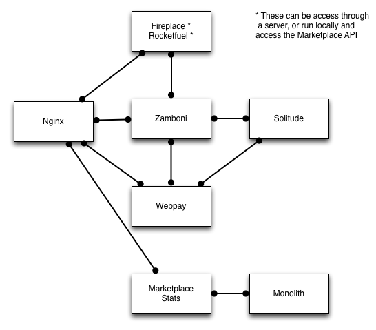

.. _backend-details:

Marketplace Backend Details
===========================

marketplace-env
---------------

Marketplace env is a library that:

* contains the fig configration, which is used to create docker containers
* wraps fig and docker commands to make it easier to develop with

So `mkt` wraps `fig` which wraps `docker`. Don't worry it's not clown shoes all
the ways down.

`mkt` Commands
~~~~~~~~~~~~~~

.. function:: mkt bash [project]

    Enters the container for the project and runs bash. If the project is not
    defined, it searches current and parent directories to find a `Dockerfile`,
    it then uses that directory name as the project.

.. function:: mkt bind

    Bind the mp.dev domain to your public IP on a Firefox OS device.

    See the :ref:`device binding <marketplace-backend-on-device>` section
    for details on how to edit the device hosts file.

.. function:: mkt check [--services] [--requirements]

    Checks your configuration, namely:

    * environment variables are set correctly
    * project checkouts (zamboni etc) can be found
    * images can be found

    Optionally flags:

    * `services` checks the nagios monitor end point for each service
    * `requirements` compares python and JS requirements files in the container
      against the project and recommends which containers should be rebuilt

.. function:: mkt checkout

    Checks out all the projects from github, using the user set with the `whoami`
    command into the path defined with the `root` command. User is set to
    `mozilla` if not defined, so you don't have to fork the projects.

.. function:: mkt chkgitconfig

    Prints out the git configuration of each tree element.

.. function:: mkt revs

    Prints out the current revisions of the tress under `mkt root`
    detailing both the rev and the active branch.

.. function:: mkt root [directory] [--buildfrom=local|hub]

    Sets the location of project checkouts to `path`. Then creates a
    new configuration file. The directory can be relative and include shell
    variables such as ~.

    By default marketplace builds all the docker containers locally. But you
    can use the Docker Hub builds by setting `--buildfrom=hub`. Using the Hub
    is faster and the container is built on each git commit.

.. function:: mkt up

    Updates the `fig` configuration file if needed. Then runs `fig up -d`.

.. function:: mkt update [--git] [--migrations]

    Updates the projects by:

    * iterates through each project and runs `git pull`
    * runs schematic migrations on each applicable project

    Optionally, if you set the `git` or `migrations` flag, it will run those
    commands only.

.. function:: mkt whoami [user name]

    Set the user to checkout projects from github, used by `checkout`. If
    `user name` is not set, it prints outs the user that is currently set.

Shell Completion
~~~~~~~~~~~~~~~~

Shell completion for the mkt command is now included. To activate it you can
add the following to your shell profile::

  eval "$(register-python-argcomplete mkt)"

`fig` Commands
~~~~~~~~~~~~~~

This is not a full list of commands, for that see: http://www.fig.sh/, just
notable ones.

.. function:: fig up

See: http://www.fig.sh/cli.html. Use this if you would like all the service
logs in the foreground run::

    fig up # Ctrl-c here will shutdown all services.

.. function:: fig logs [project]

View log output from a project's container.

`docker` Commands
~~~~~~~~~~~~~~~~~

For docs see: https://docs.docker.com/

FAQ
---

Seeing a "Couldn't connect to Docker daemon..." error
~~~~~~~~~~~~~~~~~~~~~~~~~~~~~~~~~~~~~~~~~~~~~~~~~~~~~

If you see something like::

  $ fig run zamboni ./manage.py dbshell
  Couldn't connect to Docker daemon at http+unix://var/run/docker.sock - is
  it running?

  If it's at a non-standard location, specify the URL with the DOCKER_HOST
  environment variable.

It's likely you've not set the DOCKER_HOST env variable on OSX. If you run
`boot2docker up` it will tell you what value it should be set to. Add this
to your `.bashrc` or equivalent so it's set for all shells.

Getting a "Couldn't start container" error
~~~~~~~~~~~~~~~~~~~~~~~~~~~~~~~~~~~~~~~~~~

If you see something like the following on boot2docker/docker::

  Cannot start container c44d451fcb58853bd9ef6d13ba4edf100817fce75bbfe7f9c814d68a708d82e3: setup
  mount namespace bind mounts stat /Users/whatevar/git/marketplace-env/trees/spartacus: no such file or directory

or something like this::

  nginx_1 | nginx: [emerg] host not found in upstream "webpay_1:2601" in /etc/nginx/conf.d/marketplace.conf:2

Then it's likely fig can't see the source code. Check that the root is correct,
`mkt check` will do this for you.

If you're on OSX this probably means the shared folders are not working for some reason.

`fig build` fails on Linux saying it can't connect to the daemon
~~~~~~~~~~~~~~~~~~~~~~~~~~~~~~~~~~~~~~~~~~~~~~~~~~~~~~~~~~~~~~~~

You need to add your user to the `docker` group and probably log out/in again to make sure you
are there (run `groups` and make sure it says docker to verify)

See http://askubuntu.com/questions/477551/how-can-i-use-docker-without-sudo

How do I run migrations (Python projects)?
~~~~~~~~~~~~~~~~~~~~~~~~~~~~~~~~~~~~~~~~~~

Here's the command (runs in a new instance)::

  fig run --rm [image] schematic migrations/

E.g (for zamboni)::

  fig run --rm zamboni schematic migrations/

How do I run Python unit tests?
~~~~~~~~~~~~~~~~~~~~~~~~~~~~~~~

This command will run the unittests in a new instance::

  fig run --rm [image] python ./manage.py test --noinput -s --logging-clear-handlers

E.g. (for zamboni)::

  fig run --rm zamboni python ./manage.py test --noinput -s --logging-clear-handlers

How do I update python/node package deps (rebuild the container)?
~~~~~~~~~~~~~~~~~~~~~~~~~~~~~~~~~~~~~~~~~~~~~~~~~~~~~~~~~~~~~~~~~

This command is an example for zamboni. If deps have changed they will be installed::

  fig build [project]

E.g (for zippy)::

  fig build zippy

For all projects::

  fig build

Time is drifting in the boot2docker vm.
~~~~~~~~~~~~~~~~~~~~~~~~~~~~~~~~~~~~~~~

If this should happen you can fix it with::

  boot2docker ssh sudo ntpclient -s -h pool.ntp.org

How do I add an admin in Zamboni with docker?
~~~~~~~~~~~~~~~~~~~~~~~~~~~~~~~~~~~~~~~~~~~~~

Simply run this command replacing name@email.com with the email of the user
you've recently logged-in as::

    fig run --rm zamboni python manage.py addusertogroup name@email.com 1

How do I upgrade boot2docker?
~~~~~~~~~~~~~~~~~~~~~~~~~~~~~~~~~~~~

If boot2docker is running, stop it first with::

  boot2docker stop

To update the docker client install the latest package from
`here for OSX <https://github.com/boot2docker/osx-installer/releases/latest>`_ or `here for
windows <https://github.com/boot2docker/windows-installer/releases/latest>`_

You can then upgrade the vm with::

  boot2docker download
  boot2docker start

How do I upgrade docker?
~~~~~~~~~~~~~~~~~~~~~~~~

For OSX see http://docs.docker.com/installation/mac/#upgrading
For Windows see: http://docs.docker.com/installation/windows#upgrading

Environment
-----------

To configure the services in the Marketplace, you can either override each
project's settings file (see documentation on each project for how that would
look). Or you can alter a few environment variables that all the projects use.
This is the **recommended approach** for setting up the Marketplace until you
feel more comfortable with the settings in the Marketplace.

This documentation assumes that you know how to set environment variables on
your development platform.

+----------------------+--------------------+----------------------------+--------------------------------------+
+ Environment variable | Used by            | Description                | Default                              |
+======================+====================+============================+======================================+
| MARKETPLACE_URL      | Webpay             | URL to nginx               | http://localhost/                    |
+----------------------+--------------------+----------------------------+--------------------------------------+
| MEMCACHE_URL         | Zamboni, Webpay,   | The location of memcache   | localhost:11211                      |
|                      | Solitude           |                            |                                      |
+----------------------+--------------------+----------------------------+--------------------------------------+
| REDIS_URL            | Zamboni            | URL to redis               | redis://localhost:6379               |
+----------------------+--------------------+----------------------------+--------------------------------------+
| SOLITUDE_DATABASE    | Solitude           | dj_database_url compliant  | mysql://root@localhost:3306/solitude |
|                      |                    | URL to solitude Mysql      |                                      |
+----------------------+--------------------+----------------------------+--------------------------------------+
| SOLITUDE_URL         | Zamboni, Webpay    | URL to solitude instance   | http://localhost:2602                |
+----------------------+--------------------+----------------------------+--------------------------------------+
| SPARTACUS_STATIC     | Webpay             | URL to Spartacus static    | http://localhost:2604                |
|                      |                    | files                      |                                      |
+----------------------+--------------------+----------------------------+--------------------------------------+
| ZAMBONI_DATABASE     | Zamboni            | dj_database_url compliant  | mysql://root@localhost:3306/zamboni  |
|                      |                    | URL to zamboni Mysql       |                                      |
+----------------------+--------------------+----------------------------+--------------------------------------+
| RABBIT_HOST          | Rabbit             | Rabbit hostname            | localhost                            |
+----------------------+--------------------+----------------------------+--------------------------------------+

Other Environment Variables
~~~~~~~~~~~~~~~~~~~~~~~~~~~

Please be aware that other parts of the site infrastructure can be affected by
environment variables. Some examples:

* If you want to use custom Django settings, you can set
  `DJANGO_SETTINGS_MODULE <https://docs.djangoproject.com/en/dev/topics/settings/#designating-the-settings>`_

Serving With Nginx
~~~~~~~~~~~~~~~~~~

Marketplace is designed to be an app accessible at one domain, hitting Nginx.

Behind the scenes Nginx will proxy to the other servers on your behalf.

Most developers are using Nginx to serve out the multiple services. Your
configuration may look something like this:

You can find an example configuration file in
`our Docker repository <https://github.com/mozilla/marketplace-env/blob/master/images/nginx/nginx.conf>`_.

Default Ports
~~~~~~~~~~~~~

By default, the services listen to the following ports:

+---------------------+--------+
| Project             | Port   |
+=====================+========+
| Zamboni             | 2600   |
+---------------------+--------+
| Webpay              | 2601   |
+---------------------+--------+
| Solitude            | 2602   |
+---------------------+--------+
| Solitude Proxy      | 2603   |
+---------------------+--------+
| Spartacus           | 2604   |
+---------------------+--------+
| Zippy               | 2605   |
+---------------------+--------+
| Fireplace           | 8675   |
+---------------------+--------+
| Commbadge           | 8676   |
+---------------------+--------+
| Statistics          | 8677   |
+---------------------+--------+
| Transonic           | 8678   |
+---------------------+--------+
| Operator Dashboard  | 8679   |
+---------------------+--------+
| Receipt verifier    | 9000   |
+---------------------+--------+
